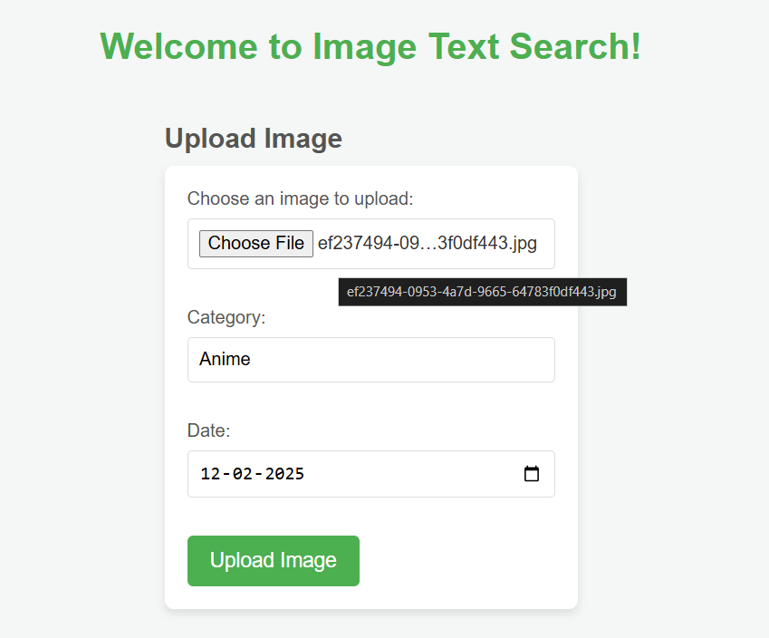
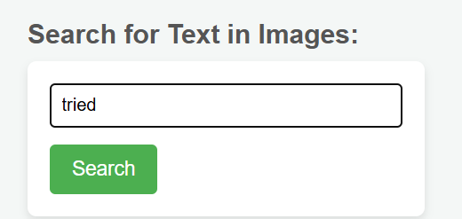
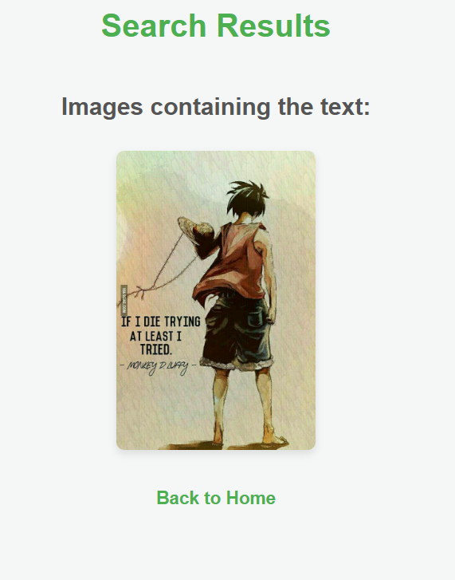

# 🔍 Enhanced Image Search

A powerful **image-based search application** that allows users to **upload an image**, search using **text queries**, and receive **relevant image results** based on the search criteria. This project leverages deep learning and feature extraction to improve image search accuracy.

---

## 🌟 Overview

- 📤 **Upload an image** and extract text features.
- 🔍 **Search using text queries** to find matching images.
- 🎯 **Retrieve relevant images** based on the search.
- 🖥 **Integrates OCR (Optical Character Recognition)** using `pytesseract` to extract text from images.
- 🗄 **Stores extracted text and metadata** in an `SQLite database` for efficient search and retrieval.

---

## ⚙️ How It Works

The application extracts text from uploaded images using `pytesseract` and stores the extracted text, along with metadata, in an SQLite database. Users can search for text queries, and matching images are retrieved based on stored text content.

---

## 🔄 App Workflow

### 1️⃣ Upload an Image


### 2️⃣ Search Using Text Query


### 3️⃣ Search Output Results


---

## 🚀 Installation

1. **Clone the repository** 🖥️
   ```bash
   git clone https://github.com/Abeshith/Enhanced-Image-Search.git
   cd Enhanced-Image-Search
   ```

2. **Create a virtual environment (optional but recommended)** 💻
   ```bash
   python -m venv venv
   venv\Scripts\activate     # On Windows
   ```

3. **Install dependencies** 📦
   ```bash
   pip install -r requirements.txt
   ```

4. **Download Tesseract Model** 📥
   - [[Download Tesseract Model]](https://github.com/tesseract-ocr/tesseract)
   - After downloading, navigate to `Environment Variables`
   - Set up the path: `C:\Program Files\Tesseract-OCR`
   - Open CMD and type:
     ```bash
     tesseract --version
     ```
   - If installed correctly, it will display the installed version.

---

## 🛠️ Usage

1. **Run the application** ▶️
   ```bash
   python app.py
   ```
2. **Open in browser:** 🌐
   - Go to `http://127.0.0.1:5000/` to access the web interface.
   - 📤 Upload an image and enter a text-based search query.
   - 🖼 View the retrieved results.

---

## 🔑 Key Functions

- **📜 Extract Text from Images:**
   ```python
   from PIL import Image
   import pytesseract
   
   def extract_text_from_image(image_path):
       img = Image.open(image_path)
       text = pytesseract.image_to_string(img)
       print(f"Extracted Text: {text}") 
       return text
   ```

- **🗄 Store Extracted Data in Database:**
   ```python
   import sqlite3
   
   def save_image_data(image_name, text, date, category):
       conn = sqlite3.connect('images.db')
       cursor = conn.cursor()
       cursor.execute('''INSERT INTO image_data (image_name, text_content, date, category) 
                         VALUES (?, ?, ?, ?)''', (image_name, text, date, category))
       conn.commit()
       conn.close()
   ```

- **🔎 Search for Images Based on Text Query:**
   ```python
   def search_text(query):
       conn = sqlite3.connect('images.db')
       cursor = conn.cursor()
       cursor.execute("SELECT * FROM image_data WHERE text_content LIKE ?", ('%' + query.lower() + '%',))
       results = cursor.fetchall()
       conn.close()
       return results
   ```

---

## 📁 Repo Structure

```
Enhanced-Image-Search/
│-- app.py                        # Main application script
│-- templates/
│   ├── index.html           # Webpage for uploading and searching images  
│   ├── results.html         # Webpage for displaying the search results
│   ├── view_db.html         # Webpage for displaying database             
│-- requirements.txt         # Dependencies
│-- images.db                # SQLite database storing extracted text data
│-- uploads/                 # Directory storing the uploaded images
|-- outputs/                 # Directory display output images
```

---
